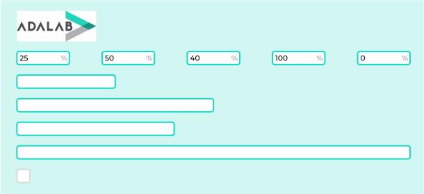

# Gráfico de barras

Hoy vamos a hacer una página que muestre un gráfico de barras como el de la siguiente imagen:

## Elementos de la página

- En la parte superior de la página debe aparecer el logotipo de Adalab.
- En el cuerpo de la página debe aparecer:
  - Un formulario con 5 campos. Cada campo debe tener un **%** a la derecha.
  - 5 barras horizontales.

> El valor del primer campo indica el ancho de la primera barra, el del segundo campo el ancho de la segunda barra...

## Funcionamiento

### Fase 1:

Al arrancar la página:

- Los campos de texto deben tener el valor 0.
- Las barras deben tener un **ancho mínimo** igual a su alto, es decir, ser un cuadrado. Por ejemplo tienen que medir 30 x 30 px.

### Fase 2:

Cuando la usuaria cambie el número de uno de los campos debemos:

- Comprobar si el valor introducido es un número entre 0 y 100.
- Si no es un número entre 0 y 100 debemos cambiar el valor del campo introducido por la usuaria y poner el número 0.

### Fase 3:

Cuando la usuaria cambie el número de uno de los campos debemos cambiar el ancho de la barra correspondiente de forma porcentual:

- Si la usuaria ha escrito 100 la barra ocupa el 100% del ancho disponible.
- Si la usuaria ha escrito 50 la barra ocupa el 50% del ancho disponible.
- Si la usuaria ha escrito 0 la barra ocupa el mínimo ancho que hemos indicado en la fase 1.

### Fase 4:

Las barras tienen que cambiar el ancho con una transición.

### Fase 5:

Ya hemos hecho que cuando un campo de texto tiene el valor 0 la barra correspondiente tiene el ancho mínimo. Ahora además vamos a hacer que cuando un campo tenga el valor el color de la barra correspondiente aparezca en gris, como si estuviera deshabilitada.

### Fase 6:

Cuando una barra mida menos del 50% el color de fondo de la misma debe ser rojo.
Cuando una barra mida más del 50%, el color de fondo de la misma deber ser azul.

### Fase 7:

La barra más larga debe tener un color del borde diferente a la de las demás.

### Fase 8:

Como sabes desde JS podemos cambiar los estilos CSS de dos formas:

- Con clases
- A fuego con `element.style.borderColor = 'red';`

Hay que refactorizar todo el código JS y CSS para que solo utilicemos estilos a fuego para indicar el ancho de las barras.

El resto de estilos los debemos cambiar añadiendo y quitando clases CSS a las barras.

---

> Nota: tienes libertad creativa para elegir colores y formas de bordes, fuentes, tamaños...

Al turrón!!!
